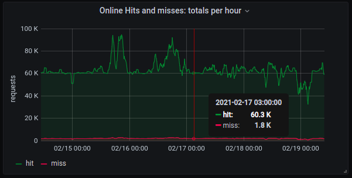

# GitHub Mirror

GitHub API mirror that caches the responses and implements
[conditional requests](https://docs.github.com/en/rest/overview/resources-in-the-rest-api#conditional-requests).

With conditional requests, all the calls are forwarded to the Github API, but
when the GitHub API replies with a 304 HTTP code, meaning that the resource
has not changed, we serve the client with the previously cached response.

That reduces the number of API calls that consume quota, helping you not to
hit the API GitHub API rate limit.

The mirror acts only on GET requests, bypassing other HTTP methods.

The default cache backend is in-memory, and we also support Redis. The
in-memory cache is shared among all the threads, but not shared between
processes. Every time the server is started, the cache is initialized empty.
Using Redis prevents the cache from being lost when the github mirror server
is restarted.


## Quick Start

Run the Docker container:

```
~$ docker run --rm -it -p 8080:8080 quay.io/app-sre/github-mirror
[2021-02-20 12:40:16 +0000] [1] [INFO] Starting gunicorn 20.0.4
[2021-02-20 12:40:16 +0000] [1] [INFO] Listening at: http://0.0.0.0:8080 (1)
[2021-02-20 12:40:16 +0000] [1] [INFO] Using worker: threads
[2021-02-20 12:40:16 +0000] [8] [INFO] Booting worker with pid: 8
```

Use it as the Github API url:

```
>>> import requests
>>>
>>> requests.get('http://localhost:8080/repos/app-sre/github-mirror')
<Response [200]>
>>>
>>> requests.get('http://localhost:8080/repos/app-sre/github-mirror')
<Response [200]>
>>>
```

After those two requests, the server log will show:

```
2020-02-16 21:08:07,948 [GET] CACHE_MISS https://api.github.com/repos/app-sre/github-mirror
2020-02-16 21:08:13,585 [GET] CACHE_HIT https://api.github.com/repos/app-sre/github-mirror
```

The second request was served from the cache and it did not consume the API
calls quota.

If you're using PyGithub, you have to pass the `base_url` when creating the
client instance:

```
>>> from github import Github
>>> gh_cli = Github(base_url='http://localhost:8080')
```

## Redis Cache Backend

To enable the Redis backend, set the environment variable:

```
CACHE_TYPE=redis
```

In addition to that, you can provide the following optional configuration:

- `PRIMARY_ENDPOINT` is the primary endpoint or host address of the Redis
  service. If not set, it defaults to `localhost`.
- `READER_ENDPOINT` is the read-only replica endpoint and can be used to
  increase the read availability of the Redis service. If not set, it defaults
  to the same address as the primary endpoint.
- `REDIS_PORT` is the port which the Redis service binds to. The default port
  is `6379`.
- `REDIS_PASSWORD` is the authentication token to access a password protected
  Redis server. If not set, the default is no authentication.
- `REDIS_SSL` should be set to `True` if you are encrypting the traffic to the
  Redis server. If not set, the default assumes no encryption.

You will find more details about the Redis cache backend implementation in the
[Redis Cache Backend doc](docs/redis_cache_backend.md).

## Metrics

The service has a `/metrics` endpoint, exposing metrics in the Prometheus
format:

```
>>> response = requests.get('http://localhost:8080/metrics')
>>> print(response.content.decode())
...
http_request_total 2.0
...
request_latency_seconds_count{cache="MISS",method="GET",status="200"} 1.0
...
request_latency_seconds_count{cache="HIT",method="GET",status="200"} 1.0
...
```

With that, as the Github API rate limit is per hour, you can have the total
HIT/MISS per hour with:

```
sum(increase(request_latency_seconds_count{endpoint="github-mirror",cache="ONLINE_HIT"}[1h]))
```

and

```
sum(increase(request_latency_seconds_count{endpoint="github-mirror",cache="ONLINE_MISS"}[1h]))
```

Plotting on Grafana, we have:



Many more metrics are available. Check the `/metrics` endpoint for details.

## User Validation

To enable the user validation, the `GITHUB_USERS` environment variable
should be available to the server. The `GITHUB_USERS` is a colon-separated
list of authorized users to have their requests to the Github Mirror served.
Example:

```
GITHUB_USERS=app-sre-bot,quay-io-bot
```

The user validation, when enabled, will not allow unauthenticated requests
to the Github Mirror.

Please notice that, in order to validate the user, one additional get request
is made to the Github API, to the `/user` endpoint, using the provided
authorization token. That call will also go through the caching mechanism, so
the rate limit will be preserved when possible.

## Offline Mode

There's a built-in mechanism to detect when the Github API is offline.

To do so, we have a separate thread that keeps checking the url
`https://www.githubstatus.com/api/v2/components.json` every second.
When we don't get a success response, or `API Requests` component is `major_outage`,
we consider the Github API offline.

When that happens, all the requests are served from the cache until we detect
that the Github API is back online.

Requests served from the cache when we are in offline mode will be accounted
for in separate metrics:

```
request_latency_seconds_count{endpoint="github-mirror",cache="OFFLINE_HIT"}
```

and

```
request_latency_seconds_count{endpoint="github-mirror",cache="OFFLINE_MISS"}
```

## Contributing

For contributing to the project, please follow the
[Development Guide](docs/devel_guide.md).
