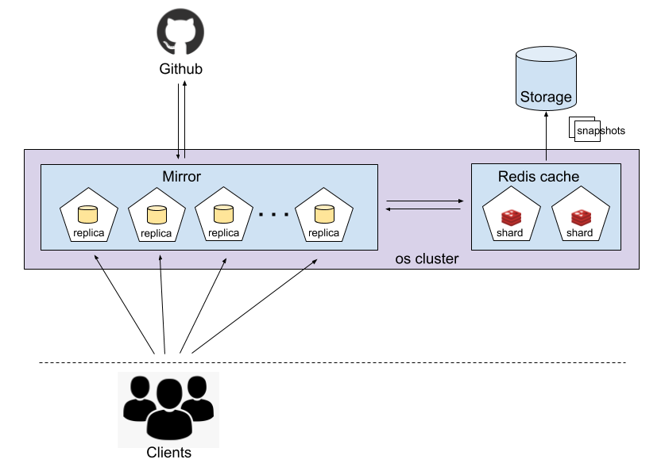

# Design document

## Goals

* Redesign the Github [mirror](#mirror) to reduce the number of Github API requests required to build up the mirror cache with every deployment. 

* Cache rebuilding time after redeployment should be constant and not grow linearly in the number of [mirror replicas](#mirror-replica). 

* Minimize latency so that the average mirror [request time](#request-time) does not increase significantly.

## Current solution

Each replica of the github mirror server maintains its own [in-memory cache](#in-memory-cache). The cache is a data structure (Python dictionary) with constant-time lookup. The cache may grow unbounded if the pod does not fail or get redeployed.

The current design incurs a significant overhead during redeployment as each replica has to build and maintain its own copy of the cache. This design does not scale well if the number of replicas is increased, as the [hourly quota](https://developer.github.com/v3/#rate-limiting) for Github API requests will quickly be exhausted, causing a hold up for all [clients](#client) depending on this service.

## Proposed solution

* Replace each pod's in-memory cache with a single shared cache for all pods. 

    * The [cache server](#cache-server) should be deployed within the same Open Shift cluster as the Github mirror to reduce the latency associated with requests to the cache.

    * A shared cache should reduce the number of calls to the Github API since each pod will not maintain its own copy of the cache.

    * When the mirror is redeployed, the cache will have to be rebuilt once only, instead of once for *each* replica.

* A highly available key-value store such as Redis can be used as the cache server.

    * The [etags](https://developer.github.com/v3/#conditional-requests) returned with each conditional request to the Github API are unique 

    * Redis does not guarantee [strong consistency](https://redis.io/topics/cluster-tutorial#redis-cluster-consistency-guarantees) which is acceptable since any stale cache reads will always be compared against the response from the conditional request, resulting - in the worst case - in an additional request to the Github api as well as unnecessairly replacing the cache entry.

This redesign should enable multi-processing for the mirror since different processes can access the shared cache server which is currently not possible when using an in-memory data structure.

### Architecture diagram

## Scope

* Backing up the cache is not necessary as long as the cache rebuild time is constant in the size of mirror replicas.

* Project should use free and open source software and not incur an additional dollar cost.

## Acceptance Criteria

* A successful solution will provide a highly available, low latency mirror server, that can be easily scaled from 3 to 100 replicas.

* Additional latency due to redesign will be < 10 ms and total request time will not exceed 3 [http request times](http://services.google.com/fh/files/blogs/google_delayexp.pdf).

* User can set up the mirror to use either the per-pod in-memory cache or the Redis server simply by modifying a configuration file. 

## Extensions

* Create a backup of the cache to avoid unecessairly rebuilding it in the case or a server/pod failure or redeployment. One solution would involve rebuilding the cache from snapshots stored in an external database.

* To increase availability and to keep the cache from growing too large, sharding can be used to break up the cache into smaller parts stored on separate shards.

## Open Questions

* How are results of http requests stored in Redis? Do they need to be serialized?

## Glossary

* **client**: any application making http requests to the mirror

* **mirror**: serves cached data to the client and makes conditional requests to the github api

* **mirror replica**: replicas of the mirror server, increasing availability and fault tolerance

* **cache server**: server which caches results of Github API calls by the mirror

* **in-memory cache**: *in this context*, it refers to each pod's ephermeral cache that is lost when a pods fails, is deleted, or redeployed. Not to be confused with Redis which is often described as an in-memory cache!

* **request time**: the time it takes for the client to receive a response to a request made to the mirror server, and this includes the time the mirror takes to make Github API calls and make requests to the cache. 