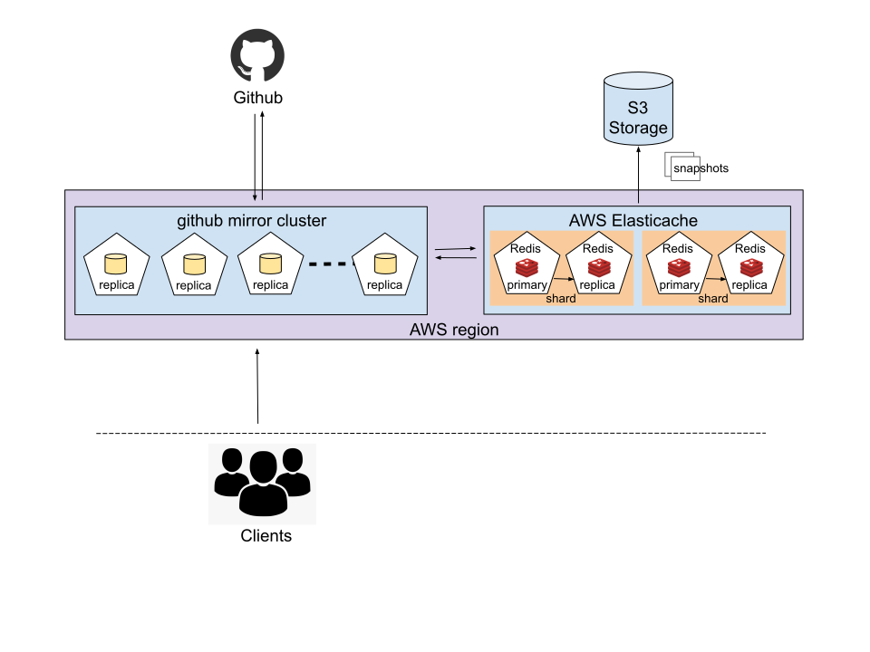

# Design Document for Github Mirror

## Context

The github mirror acts as a proxy for the Github API and is used to limit the number of calls to the Github API by serving cached objects to the client whenever possible. This prevents clients from becoming rate limited by exceeding their hourly API quota too quickly.

When a client requests a resource from the mirror, the mirror first looks up the resource in the cache to obtain its [etag](https://developer.github.com/v3/#conditional-requests) (which identifies the version of the resource). If it is found, the mirror includes this etag in a conditional request to the Github API. If the cache entry is stale, the mirror will receive the new version of the resource (along with a new etag) which it then caches and serves to the client. However, if the resource has not changed the mirror will receive a [304 Not Modified](https://www.w3.org/Protocols/rfc2616/rfc2616-sec10.html) response and will serve the cached object to the client.

## Goals

* Re-design the Github [mirror](#mirror) to reduce the number of Github API requests required to build up the mirror cache with every pod restart (ex: pod failure, deployment, etc.). 

* Specifically, cache rebuilding after a restart should require only one API call per resource per [client](#client), so that the number of API calls does not grow linearly in the number of [mirror replicas](#mirror-replica). 

* Minimize latency in the redesign so that the average mirror [request time](#request-time) does not increase significantly.

## Current solution

The github mirror is deployed in an OpenShift cluster with a replication factor of 3.

Each replica of the github mirror server maintains its own [local in-memory cache](#local-in-memory-cache). The cache is a data structure (Python dictionary) with constant-time lookup. The cache may grow unbounded if the pod continues running and does not restart.

The current design incurs a significant overhead during redeployment, as each replica has to build and maintain its own copy of the cache (meaning each replica makes one API call per resource per client). This design does not scale well if the number of replicas is increased, as the [hourly quota](https://developer.github.com/v3/#rate-limiting) for Github API requests will quickly be exhausted, causing a hold up for the client for the remainder of the hour.

## Proposed solution

### Overview
* Replace each pod's local in-memory cache with a single shared [cache server](#cache-server) for all pods, and periodically back up the cache contents in an object store. 

    * A shared cache should reduce the number of unnecessary calls to the Github API since each pod will not maintain its own copy of the cache, and therefore will not have to request the same resource more than once per client.

    * When the cache server is restarted or redeployed, it can restore the cache state from backup to avoid exhausting the API quota due a sharp increase in cache misses (if otherwise starting with an empty cache).

    * The cache server should be deployed within the same region as the Github mirror OpenShift cluster to reduce the latency associated with requests to the cache.

* Use an in-memory key-value store as the shared cache server.

    * An in-memory store is important to minimize latency.

    * Each request by a client to the Github API returns a response containing a unique etag. Therefore a key-value store can be used to map each client request to the unique response object.

* The key-value store should meet the following requirements.

    * Highly available, to prevent bottlenecks and minimize latency.
    * Persistent, to prevent loss of all cached information in the case of a pod restart.
    * Weakly consistent, since we can tolerate stale reads

### Implementation details

* Given the project requirements, the shared cache will be implemented using [AWS Elasticache](https://aws.amazon.com/elasticache/pricing/) for Redis.

    Why Redis?

    * Since the goal is to minimize response time, a in-memory key-value is needed. There are several key-value stores that meet the critera, notably [Redis](https://redis.io/) or [Memcached](https://memcached.org/).

    * Memcached has a limit on the size of the object being stored (< 1 MB), however, most of the response objects returned by the API will be small and therefore Memcached or Redis will both work in this regard.

    * The main advantage that Redis has over Memcached is with regards to availability and persistence. [Memcached does not offer replication or persistence](https://docs.aws.amazon.com/AmazonElastiCache/latest/mem-ug/SelectEngine.html), so if the server fails or is restarted, the cache will be lost.

    * Redis offers [persistence](https://redis.io/topics/persistence) using RDB files which are snapshots of the data written to disk at specifiable intervals. These snapshots can be backedup in an object store like S3. Redis also provides more durable persistence using AOF logs that write each server request to disk, but this level of durability is not needed here.

    * Redis can be configured to be [highly available](https://redis.io/topics/sentinel) with automatic failover. 

    * A Redis cluster provides [weak consistency](https://redis.io/topics/cluster-tutorial#redis-cluster-consistency-guarantees) which is acceptable since any stale cache reads will result in an additional request to the Github API (as well as unnecessarily replacing the cache entry), but the client will not receive stale data.

    * Other useful features of Redis include sharding the cache if it gets too big, as well as the ability to select from a number of cache eviction policies.

    Why AWS Elasticache?

    * Managing a persisent, highly-available and sharded Redis cluster can be greatly simplified using Elasticache, thereby reducing the maintence burden of the github mirror.

    * Since the github mirror OpenShift cluster is running on AWS nodes, the AWS Elasticache Redis cluster can be co-located in the same region to reduce network time.

* Measuring latency

    * A Prometheus metrics endpoint currently provides the latency of requests to the mirror, and is used to display the 90, 95 and 99 percentile tail latencies in Grafana. A separate metric can be added to show the additional latency created by introducing the Redis cache server.

### Architecture diagram

[image source](./images/arch.svg)

## Scope

* Cache persistence is limited to occasionally backing up the cache contents to prevent the github mirror from starting with an empty cache after a restart.

* Any additional work on metrics for Prometheus or Grafana that is necessary to analyze and evaluate the new design is within the scope of this project.

## Acceptance Criteria

* A successful solution will provide a highly available, low latency mirror server, that can be easily scaled from 3 to 100 replicas without causing the client to be rate limited by the Github API.

* Restarting the github mirror will not cause a large spike in cache misses, if a backup of the cache contents is available. It is expected that a few writes to the cache will be lost in the process, but that is an acceptable outcome and can be adjusted by changing the snapshotting frequency.

* Additional latency due to redesign will not exceed 3 [http request times](http://services.google.com/fh/files/blogs/google_delayexp.pdf).

* Users can set up the mirror to use either the per-pod local in-memory cache or the Redis server simply by modifying a configuration file. 

* If the Redis cache is unavailable, the github mirror can default to using the local in-memory cache.

## Glossary

* **client**: any application making http requests to the mirror.

* **mirror**: serves cached data to the client and makes conditional requests to the Github API.

* **mirror replica**: replicas of the mirror server, increasing availability, fault tolerance and distributing the load.

* **cache server**: server which caches results of Github API calls by the mirror.

* **local in-memory cache**: *in this context*, it refers to each pod's ephermeral cache that is lost when a pods fails, is deleted, restarted or redeployed. Not to be confused with Redis which is often described as an in-memory cache!

* **request time**: the time it takes for the client to receive a response to a request made to the mirror server, and this includes the time the mirror takes to make Github API calls and to make requests to the cache. 
